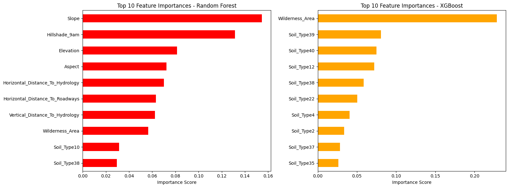

# Forest Cover Type Prediction

## 📌 Overview
This project tackles a **multi-class classification problem** to predict forest cover types using cartographic and environmental features from the [UCI Covertype Dataset](https://www.kaggle.com/datasets/zsinghrahulk/covertype-forest-cover-types). The goal is to compare tree-based models (Random Forest, XGBoost) and optimize their performance through hyperparameter tuning.

**Key Steps:**
- Data cleaning & preprocessing (handling categorical variables, scaling).
- Model training & evaluation (accuracy, confusion matrices).
- Feature importance analysis.
- Hyperparameter tuning with `GridSearchCV`.

---

## 📂 Dataset
**Source:** [UCI Machine Learning Repository](https://www.kaggle.com/datasets/zsinghrahulk/covertype-forest-cover-types)  
**Features:**  
- 54 attributes (elevation, soil type, wilderness area, etc.).  
- Target: 7 forest cover types (integer labels 1-7).  

**Preprocessing Highlights:**  
- Handled class imbalance using class weights in Randomforest.  

---

## 🛠️ Tools & Libraries
- **Python 3**  
- **Libraries:**  
  - `pandas`, `numpy` (data manipulation)  
  - `scikit-learn` (Random Forest, metrics, preprocessing)  
  - `xgboost` (XGBoost classifier)  
  - `matplotlib`, `seaborn` (visualizations)  

---

## 📊 Methodology & Results
### Models Compared:
1. **Random Forest** (with `class_weight="balanced"`)  
2. **XGBoost** (with manual class weights) (if you need) 

### Hyperparameter Tuning:
- Used `GridSearchCV` to optimize:
  - `max_depth`, `n_estimators` (Random Forest).  
  - `learning_rate`, `subsample` (XGBoost).  

### Key Metrics:
| Model          | Accuracy | F1-Score (Weighted) |
|----------------|----------|---------------------|
| Random Forest  | 0.94     | 0.91                |
| XGBoost        | 0.89     | 0.89 (not weighted)                |

### Visualizations:
- **Confusion Matrix:**  
    
- **Feature Importance:**  
    

---
